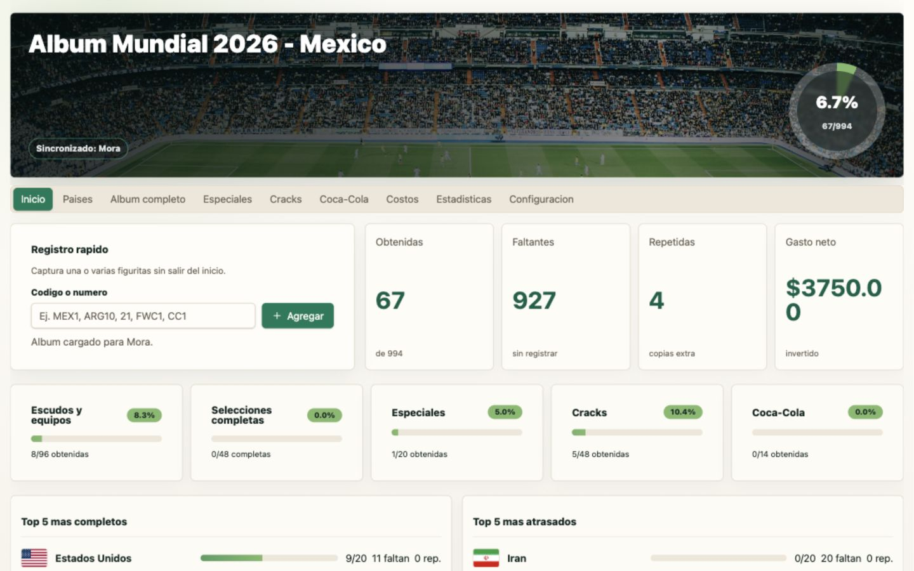
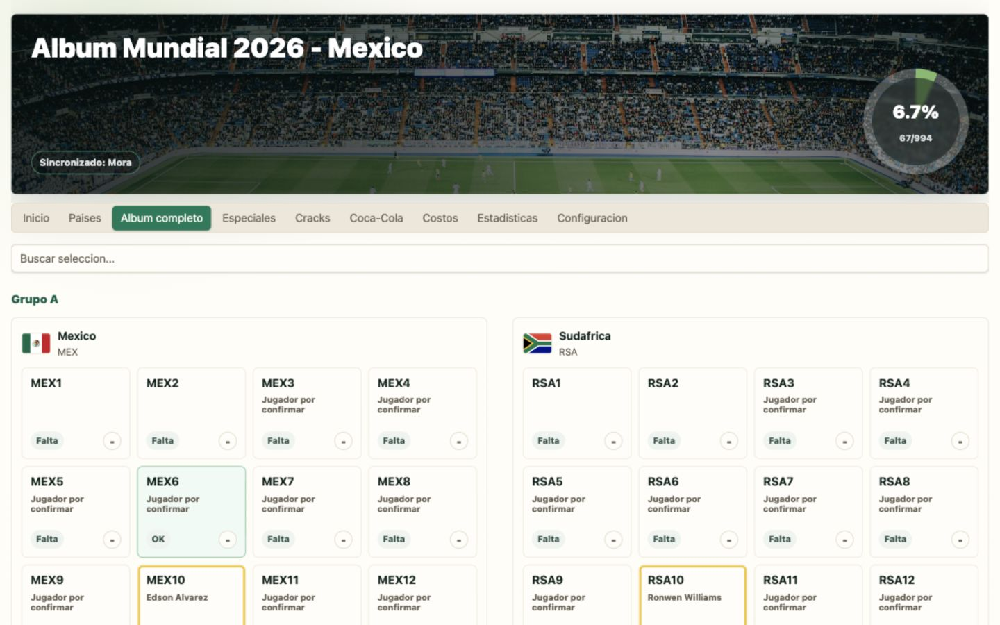
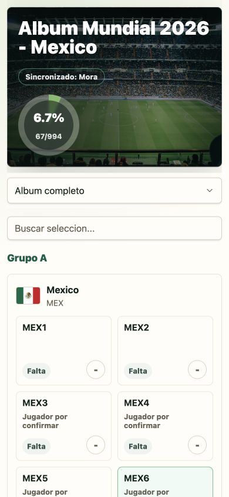

# Album Mundial 2026 MX

Una app para llevar el control de tu album del Mundial 2026 Mexico.

Sirve para registrar que figuritas ya tienes, cuales te faltan, cuantas repetidas juntaste, cuanto has gastado y como va tu avance por seleccion. Tu progreso se guarda en una cuenta, asi que puedes volver a entrar despues y continuar donde te quedaste.

App publicada: [https://album2026mx.app.bgcore.app/](https://album2026mx.app.bgcore.app/)

## Como se ve







## Que puedes hacer

- Crear una cuenta e iniciar sesion.
- Registrar una o varias figuritas rapidamente por codigo.
- Ver cuantas tienes, cuantas faltan y cuantas estan repetidas.
- Revisar el progreso por seleccion.
- Marcar especiales, cracks y figuritas Coca-Cola.
- Registrar compras para estimar el gasto del album.
- Exportar o importar un respaldo JSON desde la configuracion.

## Ejecutarlo en tu computadora

La forma mas sencilla es con Docker. No necesitas instalar Node, Python ni Postgres por separado.

### 1. Instala Docker Desktop

Descargalo desde [docker.com/products/docker-desktop](https://www.docker.com/products/docker-desktop/).

### 2. Clona este repositorio

```bash
git clone git@github.com:FrcGustavo/album2026.git
cd album2026
```

### 3. Levanta la app

```bash
docker compose up --build
```

Cuando termine de arrancar, abre:

- App: [http://localhost:8080](http://localhost:8080)
- API: [http://localhost:8000/docs](http://localhost:8000/docs)

### 4. Crea tu cuenta

Entra a la app, presiona `Crear cuenta` y empieza a registrar tu album.

### 5. Detener la app

En la terminal donde corre Docker, presiona `Ctrl + C`.

Si quieres borrar tambien la base de datos local de Docker:

```bash
docker compose down -v
```

## Ejecutarlo para desarrollo

Esta opcion es para quien quiera modificar el codigo.

Necesitas:

- Node.js / pnpm
- Python 3.12+

Instala dependencias y levanta frontend + backend:

```bash
pnpm install
cd apps/backend
python3 -m venv .venv
source .venv/bin/activate
pip install -e ".[test]"
cd ../..
pnpm dev:all
```

Despues abre:

- Frontend: [http://localhost:5173](http://localhost:5173)
- Backend: [http://127.0.0.1:8000/docs](http://127.0.0.1:8000/docs)

## Mas detalles

- Frontend React: [apps/frontend/README.md](apps/frontend/README.md)
- Backend FastAPI: [apps/backend/README.md](apps/backend/README.md)
- Documentacion tecnica general: [docs/technical.md](docs/technical.md)

## Estructura del proyecto

```text
apps/
  frontend/   La interfaz web del album
  backend/    La API, usuarios y guardado del album
docs/
  screenshots/ Capturas usadas en este README
  technical.md Detalles tecnicos del proyecto
docker-compose.yml
```

## Notas

El catalogo incluido es una estructura versionable para llevar el control del album. Si despues aparece un checklist oficial completo para Mexico, se puede reemplazar el catalogo sin cambiar toda la app.
